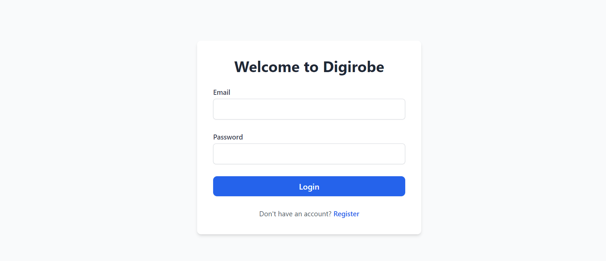
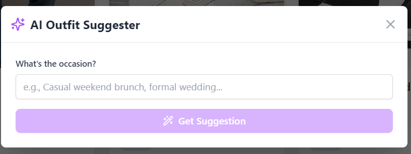

# 👗 Digirobe – Your Smart Digital Wardrobe  
*A Full-Stack AI-Powered Wardrobe & Outfit Recommender*



📍 **Live Demo:** https://digirobe.netlify.app/  
🎯 **Status:** Active | In Development  
🛠️ **Stack:** Java | Spring Boot | React | PostgreSQL | Google Gemini API | Tailwind CSS  

---

## 🌟 Why I Built Digirobe

This project started with a relatable problem:

> _“I have a closet full of clothes, but I still feel like I have nothing to wear.”_

Most of us wear only 20% of our wardrobe regularly. Planning outfits for trips, weather, or events is time-consuming and frustrating.

💡 **What if my wardrobe could live on my phone?**  
💡 **What if I could get AI-powered outfit suggestions tailored to my actual clothes?**

That idea turned into **Digirobe**, a smart, AI-powered digital wardrobe that:

✔️ Helps you store and organize clothing  
✔️ Learns your wardrobe preferences  
✔️ Suggests outfits using **Google Gemini AI**  
✔️ Tracks laundry status  
✔️ Works on web and mobile (PWA-ready)

---

## ✨ Key Features

| Feature | Description |
|--------|-------------|
| 🧾 Secure Auth | JWT-based login, signup & user sessions |
| 💼 Digital Wardrobe | Add, view, filter clothes with details & photos |
| 🎯 AI Outfit Recommender | Gemini AI suggests outfits based on event/style |
| 🧺 Laundry Mode | Track what’s clean, worn, or needs washing |
| 📸 Image Support | Upload & display photos for clothing items |
| 📱 Mobile-Friendly | Fully responsive (React + Tailwind) |
| 📦 PWA Enabled | Add to home screen, works like an app |
| 🚀 Production Ready | Deployed on Netlify (FE) and Render (BE) |



---

## 🏛️ Architecture Overview

```mermaid
flowchart LR
  User --> Frontend["React + Tailwind"]
  Frontend --> Backend["Spring Boot 3 API"]
  Backend --> DB["PostgreSQL Cloud DB"]
  Backend --> Gemini["Google Gemini API"]
